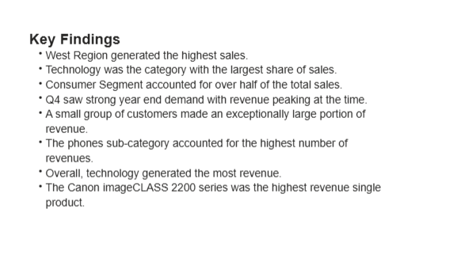
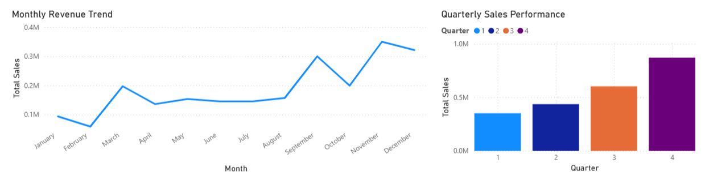
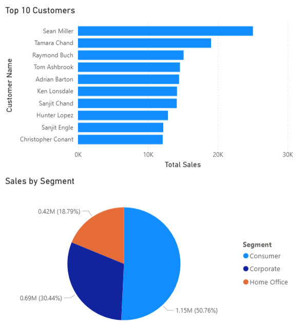
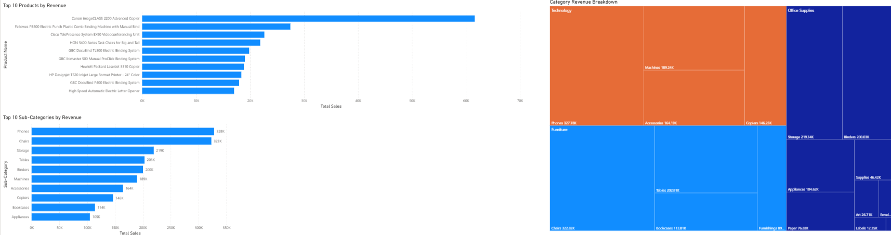

# Sales Analytics Dashboard

## Project Overview
In this project, the retail sales data is analysed by using Python, SQL, and Power BI. This analysis was done to find out sales trends, consumer behaviours, performance of products, and regional distribution of the revenue.

## Tools Used

•	Python (Pandas)

•	MySQL

•	Power BI

•	GitHub

## Dataset

•	9,800 retail sales transactions

•	Customer, product, category, and regional sales information

## Project Workflow

1.	Data Cleaning using Python
2.	Exploratory Data Analysis
3.	SQL Business Analysis Queries
4.	Power BI Dashboard Development
5.	Business Insights Generation

## Dashboard Features

#### Executive Summary

•	Total Revenue

•	Total Orders

•	Total Customers

•	Average Order Value

 
#### Sales Analysis

•	Monthly Sales Trends

•	Quarterly Revenue Analysis

•	Regional Sales Performance

#### Customer Analysis

•	Top Customers by Revenue

•	Segment Revenue Contribution

#### Product Analysis

•	Top Products by Revenue

•	Top Sub-Categories

•	Category Revenue Breakdown

#### Key Insights

•	Technology was the category that had the highest income.

•	Phones wwas the subcategory that performed best.

•	The region with the greatest contribution to income was the West region.

•	The income was at its peak during Q4.

•	A few items brought in a large proportion of income.

## Skills Demonstrated

•	Data Cleaning

•	SQL Querying

•	Data Visualization

•	Dashboard Design

•	Business Intelligence

•	Analytical Thinking

## Results

- Analyzed 9,800 retail transactions
- Generated insights from $2.26M+ in sales
- Identified top-performing products and customer segments
- Built an interactive multi-page Power BI dashboard
